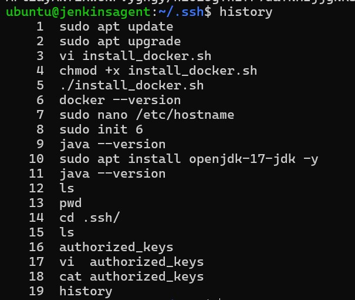

/**
docker installation script exection in file
ChatGPT
To execute a Docker installation script in a file, you can follow these steps. First, create a shell script file with the Docker installation commands, then execute the script file.

Here's an example of how you can do this:

Create a Shell Script File:
Open a text editor or IDE and create a new file. Name it something like install_docker.sh.
Write Docker Installation Commands:
Inside install_docker.sh, write the commands to install Docker. Here's an example script for Ubuntu:
bash
Copy code
#!/bin/bash

# Update package index
sudo apt update

# Install packages to allow apt to use a repository over HTTPS
sudo apt install -y \
    apt-transport-https \
    ca-certificates \
    curl \
    software-properties-common

# Add Docker's official GPG key
curl -fsSL https://download.docker.com/linux/ubuntu/gpg | sudo apt-key add -

# Set up the stable repository
sudo add-apt-repository "deb [arch=amd64] https://download.docker.com/linux/ubuntu $(lsb_release -cs) stable"

# Update package index again
sudo apt update

# Install Docker CE (Community Edition)
sudo apt install -y docker-ce

# Verify Docker installation by printing Docker version
docker --version
This script updates the package index, installs necessary packages, adds Docker's GPG key, adds the Docker repository, installs Docker CE, and verifies the installation.
Make the Script Executable:
Before running the script, make it executable. Open a terminal, navigate to the directory containing install_docker.sh, and run:
bash
Copy code
chmod +x install_docker.sh
Execute the Script:
Run the script by executing the following command in the terminal:
bash
Copy code
./install_docker.sh
This command will execute the shell script, which in turn will install Docker on your system and print the Docker version to verify the installation.
Follow Prompts (if any):
Depending on your system and configuration, you may need to enter your password or confirm installation prompts during the script execution.
After executing the script, Docker should be installed on your system, and you can start using Docker commands to manage containers and images.

/**

# node >>configuration major points  we should consider if the both servers in same vpc you can give private ip >> in case not give public ip of node 

# maven integration
# jdk integration 
# github credentials integration 

# setting>> developer settings >> token >> classic >> generate

#

# create a pipeline script (jenkinsfile) for build and test artifacts and create CI job on jenkins.

